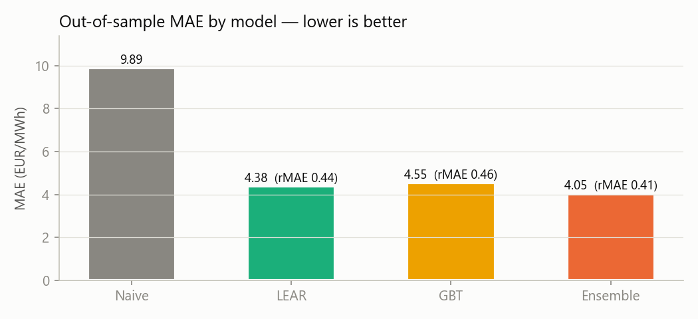
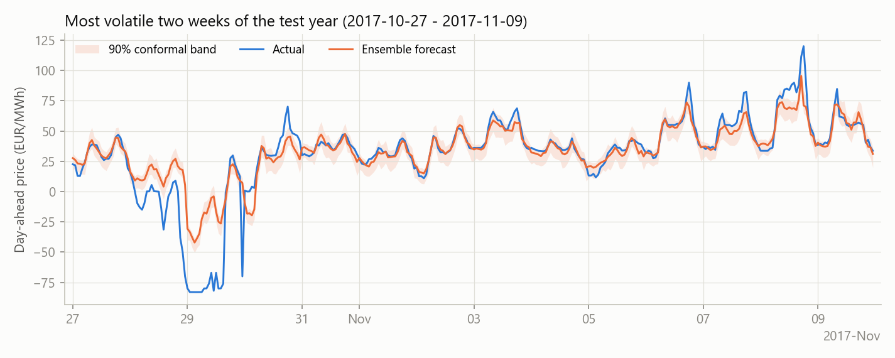
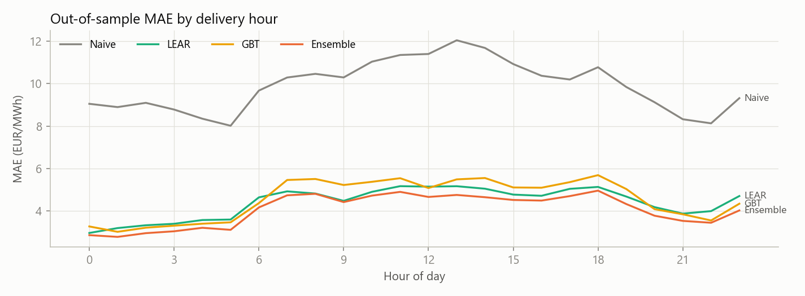

<p align="center">
  <h1 align="center" EPF System</h1>
  <p align="center">
    <strong>Day-Ahead & Intraday Electricity Price Forecasting</strong>
  </p>
  <p align="center">
    End-to-end, walk-forward-backtested forecasting pipeline for European power markets
  </p>
  <p align="center">
    <a href="#quick-start">Quick Start</a> •
    <a href="#methodology">Methodology</a> •
    <a href="#results">Results</a> •
    <a href="#data-sources">Data Sources</a> •
    <a href="#license">License</a>
  </p>
</p>

<br>


---

## Overview

Electricity is the only major commodity that **cannot be stored at scale**. This makes its price exhibit extreme statistical behavior — multi-scale seasonality, mean reversion, sudden spikes (5–20×), and even **negative prices** when renewables oversupply inflexible baseload. A Gaussian model is structurally wrong for this target.

**EPF System** is a production-oriented Python pipeline that forecasts **24 hourly day-ahead prices** and **intraday DA→ID spreads** with:

-  **No look-ahead leakage** — forecasts use only information available before the SDAC 12:00 CET gate closure, enforced structurally and unit-tested
-  **Probabilistic output** — asymmetric split-conformal intervals (day-ahead) and CQR-corrected quantile bands (intraday)
-  **Rigorous validation** — walk-forward backtesting, Diebold–Mariano significance tests, and honest coverage reporting
-  **Modular architecture** — swap data sources, models, or features without touching the backtest engine

The day-ahead layer follows the strongest published open benchmarks ([Lago et al., 2021](https://doi.org/10.1016/j.apenergy.2021.116983)); the intraday layer models the DA→ID spread as a function of residual-load surprises.

---

## Architecture

```
epf-system/
│
├── epf/                          # Core library
│   ├── data.py                   # Data loaders: ENTSO-E API, epftoolbox, synthetic
│   ├── validation.py             # Data quality: gap/duplicate repair + anomaly reports
│   ├── features.py               # LEAR-style design matrix, residual load, AsinhScaler
│   ├── models.py                 # NaiveDaily, LEAR, LEARWindows, GBT, Ensemble
│   ├── backtest.py               # Walk-forward engine, rolling recalibration, conformal
│   ├── intraday.py               # DA→ID spread model (quantile GBT + CQR correction)
│   └── metrics.py                # MAE, rMAE, sMAPE, pinball, coverage, Diebold-Mariano
│
├── scripts/                      # Entry points
│   ├── run_dayahead.py           # Day-ahead backtest CLI
│   ├── run_intraday.py           # Intraday spread backtest CLI
│   ├── download_entsoe.py        # ENTSO-E data downloader with caching
│   └── make_plots.py             # README figures from a saved backtest run
│
├── tests/
│   └── test_pipeline.py          # 7 tests: no-look-ahead, DM, conformal, repairs
│
├── docs/img/                     # Result figures (committed)
├── data/                         # Cached downloads (gitignored)
├── outputs/                      # Forecasts, intervals, metrics, DM p-values (CSV)
├── ROBUSTNESS.md                 # Change log of every robustness improvement
├── requirements.txt
└── LICENSE                       # MIT
```

### Model Pipeline

```
┌─────────────┐     ┌──────────────┐     ┌────────────────┐     ┌──────────────┐
│  Data Layer │────▶│   Features   │────▶│    Models       │────▶│   Backtest   │
│             │     │              │     │                 │     │              │
│ • ENTSO-E   │     │ • Price lags │     │ • NaiveDaily    │     │ • Walk-fwd   │
│ • epftoolbox│     │ • Exog DA fc │     │ • LEAR (Lasso)  │     │ • Conformal  │
│ • Synthetic │     │ • Res. load  │     │ • LEARWindows   │     │ • DM test    │
│             │     │ • Calendar   │     │ • GBT (LightGBM)│     │ • Metrics    │
│ Validation  │     │ • AsinhScale │     │ • Ensemble      │     │              │
└─────────────┘     └──────────────┘     └────────────────┘     └──────────────┘
```

---

## Quick Start

### Prerequisites

- Python ≥ 3.10
- (Optional) [LightGBM](https://lightgbm.readthedocs.io/) for faster gradient boosting — falls back to sklearn's `HistGradientBoostingRegressor` automatically

### Installation

```bash
git clone https://github.com/GiacomoPapa01/epf-system.git
cd epf-system
pip install -r requirements.txt
```

### Run Tests

```bash
python tests/test_pipeline.py
```

### Smoke Test (no data/API needed)

```bash
# Day-ahead: synthetic German-like market
python scripts/run_dayahead.py --source synthetic --days 480 --cal 300 --test 45 --recal 5

# Intraday spread
python scripts/run_intraday.py --source synthetic --days 300 --cal-hours 4800 --test-hours 720
```

### Reproducible Open Benchmark

```bash
# 6-year German market, Lago et al. epftoolbox data (auto-downloads on first run).
# --recal 7 reproduces the README results in ~30 min; --recal 1 is the published
# gold-standard protocol (slower, LEAR-only recommended).
python scripts/run_dayahead.py --source epftoolbox --market DE --cal 730 --test 365 --recal 7
```

### Real Data via ENTSO-E

```bash
# 1. Get a free API key at https://transparency.entsoe.eu
#    Put ENTSOE_KEY=your_key in .env (gitignored) or export it

# 2. Download and cache data
python scripts/download_entsoe.py --zone DE_LU --start 2021-01-01

# 3. Run backtest
python scripts/run_dayahead.py --source entsoe --start 2021-01-01 --cal 730 --test 365

# 4. Intraday (requires real EPEX ID3 data via --id-csv)
python scripts/run_intraday.py --source entsoe --id-csv my_id3.csv
```

All outputs (forecasts, metrics, DM p-values) are saved as CSV to `outputs/`.

---

## Methodology

### Day-Ahead Forecasting

**Framing.** Forecast the 24 hourly prices of day D using only information available before the 12:00 D−1 gate closure. No-look-ahead is enforced structurally (day-level shifts in feature engineering) and verified by unit tests.

#### Features (LEAR set + extensions)

| Category | Features | Leakage-safe? |
|----------|----------|:------------:|
| **Price lags** | Full 24h vectors at lags 1, 2, 3, 7 days |  D−1 price fixed at D−2 auction |
| **Exogenous forecasts** | `load_fc`, `wind_fc`, `solar_fc` for D, D−1, D−7 |  TSO publishes before auction |
| **Residual load** | `load_fc − wind_fc − solar_fc` (merit order proxy) |  Derived from forecasts |
| **Calendar** | Day-of-week dummies, annual sin/cos |  Deterministic |

**Scaling:** Asinh + median/MAD standardization ([Uniejewski et al.](https://doi.org/10.1016/j.apenergy.2018.09.226)) — robust to spikes and handles negative prices natively (unlike log).

#### Models

| Model | Description | Role |
|-------|-------------|------|
| **NaiveDaily** | `price(D) = price(D−1)`; Mon/Sat/Sun → `price(D−7)` | Mandatory rMAE denominator |
| **LEAR** | One Lasso per hour, λ by AIC, on asinh-scaled data | State-of-the-art linear benchmark |
| **LEARWindows** | LEAR averaged over multiple calibration windows (56, 84, 365, 730 days) | Regime adaptation |
| **GBT** | LightGBM (or sklearn fallback), winsorized targets | Non-linear model |
| **Ensemble** | Simple average of LEAR + GBT | Hardest baseline to beat in EPF |

#### Validation Protocol

```
Walk-forward (rolling origin) — expanding calibration window:

[============= train (rolling cal_days) =============][ test day D ]
                                          ↓ recalibrate
[=============== train ===============================][ test D+1   ]
```

- **Rolling calibration window** (default 730 days), recalibration every `--recal` days
- **Never K-fold randomized** — with regime shifts (e.g. 2021–22 gas crisis) it would leak the future into training
- **Diebold–Mariano test** (multivariate, daily losses) for statistical significance

#### Uncertainty Quantification

**Asymmetric split-conformal intervals** per hour: rolling quantiles of the *signed* out-of-sample residuals at α/2 and 1−α/2. Power prices are right-skewed (spikes), so symmetric |residual| bands over-cover on the left and under-cover exactly where risk lives. The asymmetric approach fixes both while preserving the distribution-free coverage guarantee.

---

### Intraday Spread Forecasting

**Target:** `spread(h) = ID_price(h) − DA_price(h)`

**Key driver:** Residual-load surprise `res_load_act − res_load_fc`, lagged by a configurable knowledge lag (default 2h) to mimic real publication delays — the model never sees the concurrent hour.

| Component | Detail |
|-----------|--------|
| **Model** | Quantile gradient boosting (q10/q50/q90) |
| **Band correction** | CQR — Conformalized Quantile Regression ([Romano et al., 2019](https://arxiv.org/abs/1905.03222)) |
| **Evaluation** | MAE vs "ID = DA" naive, 80% coverage, directional accuracy |

---

## Results

**Real data, real out-of-sample year.** All figures below come from the German market (EPEX DE, [Lago et al. open benchmark data](https://doi.org/10.1016/j.apenergy.2021.116983)): calibration on a rolling 730-day window, test on the **full calendar year 2017** (365 days, never seen in calibration), recalibration every 7 days. Reproduce with:

```bash
python scripts/run_dayahead.py --source epftoolbox --market DE --cal 730 --test 365 --recal 7 --out outputs/de_benchmark
python scripts/make_plots.py --run outputs/de_benchmark --out docs/img
```

### Day-Ahead — German market, 365-day out-of-sample

| Model | MAE (€/MWh) | RMSE | rMAE | sMAPE% | Coverage 90% | Pinball |
|-------|:-----------:|:----:|:----:|:------:|:------------:|:-------:|
| Naive | 9.89 | 16.50 | 1.00 | 34.1 | — | — |
| LEAR | 4.38 | 7.61 | 0.44 | 16.7 | 87.6% | 0.80 |
| GBT | 4.55 | 8.03 | 0.46 | 17.5 | 87.2% | 0.83 |
| **Ensemble** | **4.05** | **7.29** | **0.41** | **15.7** | 87.4% | **0.75** |



The ensemble cuts the naive benchmark's error by **59%** (rMAE 0.41), in line with the strongest published results on this dataset. Two readings worth making explicit:

- **The linear model is nearly unbeatable on its own.** LEAR (one Lasso per hour on asinh-scaled data) lands within 8% of the ensemble — a recurring finding in the EPF literature: with the right feature set, regularized linear regression is an extremely strong baseline, and any nonlinear model has to earn its keep.
- **The ensemble is still statistically better.** The multivariate Diebold–Mariano test on daily losses gives p < 10⁻⁴ for ensemble vs. both members, while LEAR vs. GBT is statistically indistinguishable (p = 0.17) — the classic case where averaging two equally-good, differently-wrong models is the only free lunch available.

| DM p-values (row vs col) | naive | lear | gbt | ensemble |
|---|:---:|:---:|:---:|:---:|
| **naive** | — | 0.000 | 0.000 | 0.000 |
| **lear** | 0.000 | — | 0.174 | 0.000 |
| **gbt** | 0.000 | 0.174 | — | 0.000 |
| **ensemble** | 0.000 | 0.000 | 0.000 | — |

### What the forecasts look like under stress



This is the **most volatile fortnight of the test year, selected automatically** — it happens to contain storm *Herwart* (28–30 Oct 2017), when record wind generation pinned German prices at the −83 €/MWh floor for hours. Honest commentary:

- The model **calls the direction of the crash** — the forecast goes deeply negative on the right day — but underestimates its depth: a day-ahead model only knows the wind *forecast*, and the storm out-ran it. That residual risk is exactly what the intraday layer exists for.
- The **90% conformal band visibly widens** through the episode and tightens again in the calm week after: the rolling asymmetric conformal calibration adapts to volatility regimes without any distributional assumption.
- Outside the storm, forecast and actual are near-indistinguishable at this scale — the 4 €/MWh MAE is dominated by spike days, not by systematic bias.

### Where the error lives



Errors concentrate in the **morning ramp (07–09)** and **evening peak (17–19)** — the steep segments of the merit-order curve, where a 1 GW residual-load surprise moves the price most. The naive benchmark is worst mid-day because day-to-day solar variability wrecks similar-day logic; the fitted models absorb it through the solar forecast features.

**Coverage honesty:** empirical 90%-band coverage is 87–88%, not 90%. The gap is concentrated in spike regimes, and the number is computed *without* the conformal warm-up period (days with insufficient residual history get no band at all rather than a backfilled one — backfilling would leak future residuals). A slightly conservative reading beats a flattering one.

### Intraday Spread (proxy demo)

| Metric | Value |
|--------|:-----:|
| MAE vs naive "ID = DA" | 7.0 vs 14.4 €/MWh |
| rMAE | 0.49 |
| Coverage 80% | 75.3% |
| Directional accuracy | 85.3% |

> The intraday layer runs on a **proxy spread** (real EPEX ID indices are licensed): the machinery — quantile GBT, CQR band correction, knowledge-lagged features — is validated end-to-end, but these numbers demonstrate the pipeline, not real-market economics. Plug in real ID3 data via `--id-csv` for the latter.

---

## Data Sources

| Source | Coverage | Access | Used for |
|--------|----------|--------|----------|
| **ENTSO-E Transparency** | All EU zones, DA prices + load/wind/solar fc/act | Free API key | Both layers |
| **epftoolbox** | DE, NP, PJM, BE, FR — 6 years each | Open, bundled | Reproducible benchmarks |
| **EPEX intraday indices** | ID1/ID3/VWAP | Licensed | Real intraday target |
| **Synthetic generator** | Configurable | Built-in | Testing & development |

---

## Test Suite

7 unit tests covering critical invariants:

| Test | What it verifies |
|------|------------------|
| `test_no_lookahead_in_design_matrix` | Price features only from strictly earlier days |
| `test_dm_test_symmetric` | DM test correctly identifies the better model |
| `test_asinh_scaler_roundtrip` | `AsinhScaler` perfectly invertible |
| `test_validation_repairs_gaps_and_duplicates` | Gap + duplicate repair with correct reporting |
| `test_panel_repairs_dst_like_day` | 23-hour DST days repaired, not dropped |
| `test_asymmetric_conformal_coverage` | Asymmetric bands achieve target coverage on skewed errors |
| `test_learwindows_runs` | Multi-window LEAR produces finite forecasts |

CI runs on every push via GitHub Actions (Python 3.12, full synthetic smoke test).

---

## Honest Limitations

-  **Intraday uses a proxy spread** — the machinery is validated, but real economics require actual EPEX ID prices
-  **DST days** — 23/25-hour days are dropped (standard in the literature); production code should handle them explicitly
-  **No hyperparameter tuning** for GBT — fixed sensible defaults; nested time-series CV would be the clean extension
-  **Daily recalibration of GBT** over a 1-year test takes hours — use `--recal 7` for a good accuracy/runtime trade-off
-  **DM test** uses t-approximation — for publication-grade claims, add Giacomini–White conditional predictive ability

---

## Roadmap

1. **Conformal prediction upgrade** — replace split-conformal with full CQR on the day-ahead layer for guaranteed adaptive coverage
2. **Two-stage spike model** — spike classifier (`resload > threshold`) + conditional regressor for tail accuracy
3. **LEAR + GBT ensemble blending** — stacking typically cuts another 2–5% MAE vs simple averaging
4. **Real ENTSO-E integration guide** — step-by-step notebook for onboarding new markets

---

## References

- Lago, Marcjasz, De Schutter, Weron (2021). *Forecasting day-ahead electricity prices: A review of state-of-the-art algorithms, best practices and an open-access benchmark.* Applied Energy. [doi:10.1016/j.apenergy.2021.116983](https://doi.org/10.1016/j.apenergy.2021.116983)
- Romano, Patterson, Candès (2019). *Conformalized Quantile Regression.* NeurIPS. [arXiv:1905.03222](https://arxiv.org/abs/1905.03222)
- Weron (2014). *Electricity price forecasting: A review of the state-of-the-art with a look into the future.* International Journal of Forecasting.
- Uniejewski, Nowotarski, Weron (2016). *Automated variable selection and shrinkage for day-ahead electricity price forecasting.* Energies.

---

## License

This project is licensed under the **MIT License** — see the [LICENSE](LICENSE) file for details.

---

<p align="center">
  Made with ⚡ by <a href="https://github.com/GiacomoPapa01">Giacomo Papa</a>
</p>
